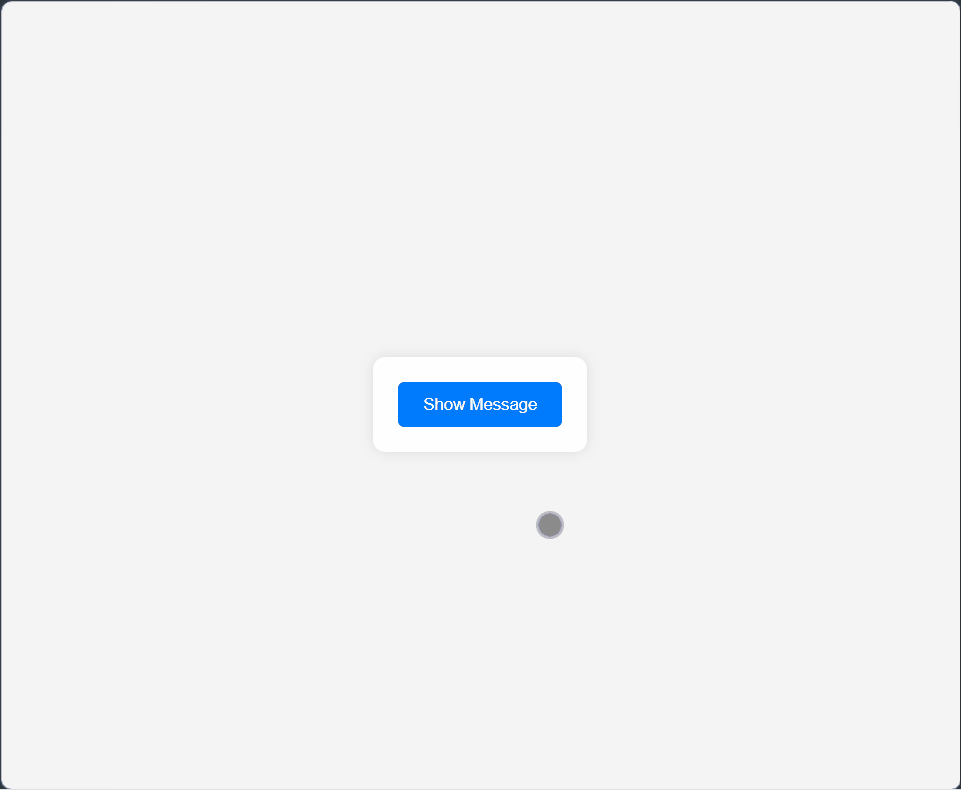

# 🔀 Toggle Text App

A simple interactive **React + TypeScript** app built with **Vite** that demonstrates toggling text visibility.  
This project highlights **state management with React hooks**, **component reusability**, and modern frontend tooling.

---

## 🚀 Live Demo

[View Project](https://himanshu-kumar-2301.github.io/fcc-toggle-text-app/)

---

## 🛠️ Tech Stack

- **React 18** - UI components
- **TypeScript** - type safety
- **Vite** - build tool & dev server
- **ESLint** - linting & code quality

---

## 📸 Screenshots



---

## 📚 Features

- Toggle text on and off with a button.
- Real-time UI updates using **React state**.
- Clean, responsive design.
- Built with **TypeScript** for type safety.
- Fast development workflow powered by **Vite**.

---

## 📂 Project Structure

```code
root/
|--public/
|--src/
|  |--styles.css
|  |--main.tsx
|  |--components/
|  |  └──ToggleText.tsx
|  └──assets/
|     └──screenshot.gif
|--index.html
|--package.json
|--vite.config.ts
|--tsconfig.json
|--README.md
```

---

## 🧑‍💻 How to Run Locally

1. Clone the repo:

    ```bash
    git clone https://github.com/himanshu-kumar-2301/fcc-toggle-text-app.git
    ```

2. Navigate into the folder:

    ```bash
    cd fcc-toggle-text-app
    ```

3. Install dependencies

    ```bash
    npm install
    ```

4. Start the dev server

    ```bash
    npm run dev
    ```

---

## 🎯 Learning Highlights

- Practiced React state management with useState.
- Configured TypeScript + Vite for modern workflow.
- Applied ESLint rules for consistent coding standards.
- Built a minimal, reusable component for text toggling.

---

## 📌 Future Improvements

- Add animation when toggling text.
- Support multiple toggle sections.
- Provide customizable props for text content and button labels.
- Publish as an npm package for easy integration.

---
